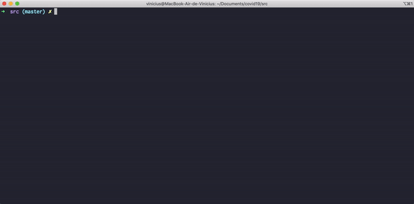

# Covid19 Tracker :mask:
Um cliente em shell para se manter atualizado sobre a doença do coronavírus.

## :mount_fuji: Inicio
### Pré-Requisitos
- bash (https://www.gnu.org/software/bash/)
- curl (https://github.com/curl/curl)
- jq (https://stedolan.github.io/jq/)

### Instalação
Em um terminal, clone este repositório em sua máquina com o comando.
```
git clone https://github.com/hvini/covid19-tracker
```

Depois mude o diretorio de trabalho com o seguinte comando.
```
cd covid19-tracker/src
```

Por fim torne-o script executavel, e execute-o com os comandos, respectivamente.
```
chmod +x covid.sh
./covid.sh
```

### Exemplo


## :book: Licença
Este projeto é distribuido sobre a licença MIT, veja o arquivo [LICENSE.md](LICENSE.md) para mais detalhes.

## :sparkles: Reconhecimentos
- Covid19-cli (https://github.com/garrylachman/covid19-cli)  
Projeto de inspiração.

- Linux-cookbooks (https://github.com/gdbtek/linux-cookbooks)  
Para exibição das informações em tabelas mais agradaveis.

- Spark (https://github.com/holman/spark)  
Utilizado para as representações gráfica.